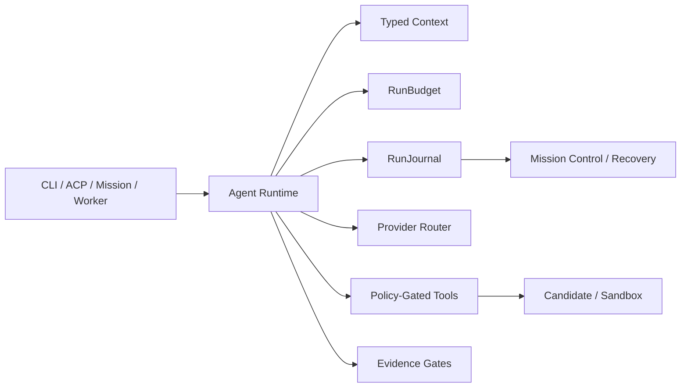

# Ronin Execution Kernel

Ronin is built as a local-first autonomous engineering platform. The product is
not a collection of chat entry points: terminal, editor, mission control,
remote workers, and future web surfaces all use the same execution contracts.

## Invariants

- **One execution contract:** `ReActAgent` and `OrchestratorAgent` use the
  same `RunBudget` and `RunJournal` types. New surfaces adapt these contracts;
  they do not create an alternate agent loop.
- **Durable before autonomous:** checkpoints happen before later provider work.
  A resumed orchestrator consumes completed subtask results and runs only the
  unfinished dependency waves.
- **Budgets are shared, not advisory:** provider usage and tool calls use the
  same thread-safe budget instance across parallel specialists. A limit blocks
  later actions; it never silently converts an unknown cost to zero.
- **Safety is external to model judgment:** agent output, memory, repository
  risk, and provider choice may inform work but cannot grant a tool permission.
  The existing approval, destructive-command floor, sandbox, and candidate
  verification layers remain the authority.
- **Evidence is compact:** durable event streams record lifecycle and safe
  identifiers. Full prompt, tool, and subtask state is kept only in local,
  integrity-checked checkpoints needed for recovery.

## Shipped Core

`packages/agent-patterns` now provides:

- `RunJournal`: append-only SQLite events plus SHA-256 checked atomic
  checkpoints.
- `RunBudget`: token, cost, wall-clock, tool-call, concurrency, and nesting
  ceilings with thread-safe reservations.
- `ReActAgent`: context attribution, durable checkpoints, recovery of pending
  tool calls, and shared budget enforcement.
- `OrchestratorAgent`: durable plan/wave/synthesis checkpoints, safe lifecycle
  events, shared budget enforcement across parallel specialists, and
  `resume(run_id, journal)` that never replays a completed wave.

## Product Layers

The kernel supports a deliberate progression:

1. **Interactive engineering:** CLI and ACP use typed context, provider routing,
   approvals, and local sessions.
2. **Verified missions:** issue intake, plan approval, isolated candidates,
   Docker verification, review/security gates, and local PR proposals.
3. **Specialist teams:** architect, implementer, reviewer, tester, security,
   and release roles exchange typed handoffs and evidence, never raw control
   messages.
4. **Remote execution:** authenticated workers receive bounded candidate jobs
   and return compact evidence; they cannot merge, approve, or publish.
5. **Platform integrations:** API keys, MCP capability scopes, CI/webhooks, and
   provider routing are adapters around the same policy and audit boundaries.

This lets Ronin expand in capability without making autonomy depend on one
provider, one UI, or unbounded background agents.
