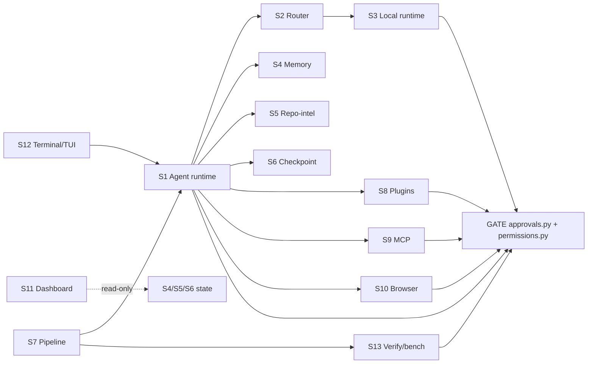

# Ronin vNext — Module Boundaries

## Dependency direction (must-hold rules)

- **The gate depends on nothing.** `approvals.py` (universal gate + destructive/payment floor) and `permissions.py` (deny-wins allow/deny store) are the leaf authority. Every side-effecting subsystem *consumes* them; none is imported *by* them.
- **Surfaces → core → gate.** Terminal/TUI and Dashboard call the agent core; the core calls the gate at the `before_tool` chokepoint. Model plane, state, and tool providers hang off the core.
- **Tool providers → gate, always.** Plugin, MCP, and Browser runtimes emit `sensitive` tools and contribute *predicates* to the gate; they never author the decision.
- **Advisory data never authorizes.** Memory recall, Repo-intel scores, and Dashboard reads are read-only inputs that must not flow into `should_auto_approve`/`deny_reason` — enforced per-subsystem by a lint/invariant test.
- **All new persistence is local**, under `RONIN_HOME`/`~/.ronin`, as JSONL/JSON/SQLite. No new network egress; offline strips egress tools before any provider is built.

## Boundary table

| Subsystem | Owns | Does **not** own (consumes) | Inputs | Outputs |
|---|---|---|---|---|
| **S1 Agent runtime** | ReAct loop, multi-agent patterns (planner/supervisor/orchestrator/reflexion), provider abstraction + failover/effort/repetition, tool execution + arg-adaptation, context compaction, cross-turn history; **new**: `RunJournal`, `Verifier` interface, `RunBudget`; at CLI: `run_code_agent`, the `_selective_gate` prompt, sub-agent spawning | Tool *implementations* (code/git/web/lsp/browser), provider network SDKs, the permission-rule store, the destructive-marker **policy data** (stays in `approvals.py`; runtime only calls `floor()`), the hardening harness, the Ro job-bot engine | Task string, system prompt, tool list, provider config, optional history, gate callbacks, `RunBudget`, `RunJournal`, repo `verify.json` | `AgentResult` (success/output/iterations/trace/usage/messages), live `on_step`/`on_text` events, durable journal events + message snapshots (new), `Verifier` verdicts (new); every outward action first through the gate + floor |
| **S2 Provider router** | Task classification, candidate-blade assembly, cost/reliability-aware selection, the price table + `free/paid/unknown` status, the FREE/PAID/LOCAL/UNKNOWN badge, failover ordering + fail-fast retry, per-repo `RouterStats`, savings ledger | Approval gate, destructive floor, tool execution, credential storage, the concrete HTTP provider clients, sandbox/full-access/yolo policy | `RoninConfig` (provider/model/route_fast/route_strong/failover/budget/offline), task text, `RouterStats` from `.ronin/router_stats.json`, keys via `config.key_for` | A chosen (provider, model) + reason, a `FailoverProvider`/plain provider, a badge (label,hex), a `CostLedger`/savings tally, updated `RouterStats` |
| **S3 Local model runtime** | Local-brain selection policy (`is_local_provider`, `apply_offline`, new `resolve_local_backend`), offline tool-stripping, the in-process `EmbeddedProvider` (mlx/llama-cpp) + RAM/engine/model selection, the `ronin local`/`--embedded` detect→pull→persist→verify flow, the local-first embeddings fallback (`local_embed`) + its wiring, the doctor local-runtime health surface | Approval gate + floor + permissions, ReAct loop + tool sandboxing, cost/billing, cloud providers, the config file format (uses `save_config` seam only) | `RoninConfig`, machine facts (RAM, platform, `[local]` presence, Ollama reachability), the candidate tool list, the `Message` list | An `LLMProvider` (Embedded or localhost OpenAI-compat), a sanitized offline config (local + failover cleared), a filtered tool list (egress removed), an `EmbeddingBackend` (never hosted when offline), honest doctor health |
| **S4 Memory** | Storage + retrieval across three layers (short-term rolling summary, long-term semantic/keyword recall, preferences), the `LongTermBackend` Protocol + local backends (InMemory/Sqlite/embedding-aware), compression/extraction prompt orchestration, namespace scoping, persistence under `RONIN_HOME/.ronin`, per-record metadata/dedup/size-cap/TTL | Approval gate/floor/permissions (memory is a consumer of *none*), the embeddings **model** (reuses `embeddings.py`+`local_embed.py` via an injected `embed_fn`), system-prompt assembly + tool registration (`runner.py`), code/repo search, provider construction | Conversation turns, free-form user messages (extraction), recall queries + namespace + k, optional `embed_fn`/backend, config (api_key/model/`RONIN_HOME`/offline) | Ready-to-send `messages()`, ranked `MemoryRecord` hits, stored preference pairs, a prompt-injectable memory block, persisted rows |
| **S5 Repo intelligence** | The persistent index (`.ronin/index.db`: files/symbols/summaries + new import edges), BM25 ranking, the import graph + blast-radius + affected-tests, structural smells, the composed risk/hotspot score; the `ronin index/repo_map/radius/smell/risk/tree` surface + `relevant_context` | File mutation, shell execution, the gate/floor, the agent loop, LLM calls, the embeddings provider, any git-**writing** op (churn uses read-only `git log` only) — never decides whether an action is permitted | Repo root, the working diff/changed files, optional token budget, optional smell thresholds, read-only git history, optionally installed LSP servers | Ranked file lists / context block, `RadiusResult`, `list[Smell]`, `RiskResult` (all pure advisory data); only self-owned write is `.ronin/index.db` |
| **S6 Checkpoint + rollback** | Full-working-tree snapshots via git plumbing on private `refs/ronin/*` (never real index/branch/HEAD), the file-copy fallback, id scheme + `.ronin/*.json` index (atomic, locked), listing/summarizing, **reversible** restore with a mandatory pre-restore safety snapshot, retention/prune, the pure `restore_plan` diff | The gate/floor **policy** (only registers `rewind` as SENSITIVE), the resume/pipeline state machine (a consumer), real git history/branch/index/stash, secret scanning, agent tool routing | Root path, optional label, optional deterministic `now`, checkpoint id, `auto` flag, prune policy | `Checkpoint`/`RestoreResult` (with `safety_id`), private refs under `refs/ronin/checkpoints|session/*`, the JSON index, plain-text result strings for the gate/command layers |
| **S7 Pipeline runtime** | Role sequencing + stage state machine, the typed handoff artifacts + `schema_version`, the structured verifier (suite decisions, aggregate/finalize/final-verdict via the new `VerdictEngine`, tester reconciliation), evidence assembly (diff/contract/optional semantic judge), save/load/resume + git snapshot comparison, the new JSONL event log, the opt-in repair-loop control flow, pure renderers + truth table | The universal gate + destructive floor, the agent turn + tool execution (`run_code_agent`), role definitions/read-only enforcement (`roles.py`), provider/free/offline resolution, checkpoint storage, git mutation for commit/PR (`pipeline_finish`), the permission store | Task string, role list, config, write flag, verify suite specs + timeouts, diff toggles + budgets, optional resume state + checkpoint id, repair-rounds cap, injectable `stage_runner`/`approve_fn`/`run_fn`/`judge_runner`/clock | `PipelineState` (JSON-serializable: stages+artifacts+verdict+contract+semantic+diff+suites+truth-table+final-verdict), exit code, optional saved-state JSON + new event JSONL, rendered console output — no side effects except through gated `run_code_agent` + opt-in gated finish |
| **S8 Plugin runtime** | Discovery/loading, the `harden` wrapper, the library catalog + from-api/scaffold generators, a new plugin **trust store**, a non-executing **manifest** reader, plugin **capability** tags, the optional handler-isolation shim | The approval gate + destructive/payment floor (consumes, must never weaken), the allow/deny permission store (reuses the pattern + user-global per-repo trust model), the agent loop, provider dispatch, MCP client, the backend runners (reuses for isolation) | `.ronin/plugins/*.py`, plugin-library sources, per-repo trust decisions (user-global `~/.ronin`), `RONIN_PLUGIN_SANDBOX`/`RONIN_BACKEND` env, project root | `list[Tool]` uniformly hardened + `sensitive=True` + capability-tagged, `PluginLoadResult` diagnostics, manifests for display, trust/approval requests routed through the existing gate |
| **S9 MCP runtime** | Connection lifecycle for both transports (stdio + Streamable-HTTP), parsing/flattening JSON-RPC results, `.ronin/mcp.json` + the catalog, wrapping each MCP tool (`sensitive=True`, `{server}__{tool}`), the new destructive-MCP classifier, tool filter, lazy/cache, health | The approval gate machinery itself (`_selective_gate`/`before_tool`) — consumes it, now contributes one predicate; the ReAct loop; the shell destructive classifier + `SENSITIVE_TOOLS` (shared, not owned); credential storage | `.ronin/mcp.json` specs (+ new optional `timeout`/`tools`/`exclude`/`maxTools`), shell env for secrets, the session root | `list[Tool]` merged into the toolbelt, one destructive-MCP predicate exposed to the gate, `_ACTIVE` client list + health/stderr for `/mcp`, the `.ronin/mcp.cache.json` schema cache |
| **S10 Browser / action runtime** | The Playwright session lifecycle (thread-guarded) + the 5 primitives (navigate/click/type/read/screenshot), the new `browser_intent.py` classifier (tool call → approvals Action → BLOCK detection), the browser-specific floor branch in the gate, the optional host-egress policy + audit log | The approval **policy** + human prompt (`approvals.py` stays authoritative), shell/file mutators + their floor, the LLM/provider + ReAct mechanics, research grounding (`act.py`), the plan/payment-stop semantics of `ronin do`/`ronin book` | A tool call (name+args) from the `before_tool` chokepoint, config (offline/full_access/yolo/host policy), the current page URL, the approvals gate callback/console | Per-tool text result to the agent, an approvals Action dict handed to the gate, an egress/audit record, the enforced allow/deny/typed-confirm verdict for BLOCK-level browser actions |
| **S11 Dashboard (`ronin ui`)** | The self-contained HTML page, the read-only JSON/SSE endpoints (`/`, `/ui/runs`, `/ui/runs/{id}`, `/ui/memory`, `/ui/skills`, new `/ui/events`, `/ui/status`), their read-only data adapters, the `ronin ui` launcher | The CLI stores it reads (`run_store`/sessions/`memory_store`/`muscle_memory`/savings/leaderboard/`router_stats`/nightshift — upstream), the gate + floor, the `csk` SaaS (signup/connections/briefings/billing/oauth) + `apps/web`, any auth/identity | On-disk `.ronin` records under `RONIN_HOME`/CWD (read-only), `gather()`'s pure snapshot, host/port/open flags | A localhost HTTP surface — one HTML page + JSON/SSE. No writes, no egress, no store mutation, GET-only |
| **S12 Terminal + TUI renderers** | The presentation layer (agent events + approval requests → rendered output on Rich REPL + Textual TUI), the pure view-model builders (`status_segments`/`chip_strip`/`cost_badge`/`tool_label`/`_summarize_result`/`_normalize_markdown`/completion cores), theme tokens, the **display** of approval/destructive cards + the human confirmation UI | The approval **decision/policy** (`gate_level`/`is_destructive`/`is_payment`, the floor rule itself), standing permission rules, the agent loop + tool execution, provider/pricing tables, config loading | `RoninConfig`, root path, edit_mode/role, ctx tokens, elapsed, `GitState`, the Step stream + `on_text` deltas, an (name,args) tool descriptor for approval, env (`NO_COLOR`/`RONIN_BOX`/`RONIN_PINNED`/`RONIN_HUNK_REVIEW`) | Rendered bytes (Rich Console / Textual widgets); for a gated action, a `bool\|str` decision it *surfaces* from the human — while the floor/payment policy that constrains it stays in the gate core |
| **S13 Verify + benchmark engines** | Scoring + statistics of eval/benchmark runs (per-criterion means + CIs, `resolved_rate` + CI, CI-aware significance/regression), the golden-dataset LLM-judge harness, the SWE-bench execution harness + regression gate, the `verify`/`self_verify`/`pipeline_verify`/`agent_eval`/`bench`/`consensus` surfaces, the new `stats.py`/`evalstore.py`, the gated wrapper around the local git evaluator | The approval gate + destructive/payment floor (must **consume** for the git evaluator — the current bypass), the agent loop + tool execution, provider construction, the pipeline state machine (a consumer), `run_store` (precedent, not owned) | Golden datasets + tasks, repo-declared verify commands (`.ronin/verify.json`), model/provider config, optional `seed`/`samples`/`--ci` flags, prior baseline reports / `evalstore` history, throwaway sandboxes | `RunReport`/`SWEBenchReport` with new optional `summary_ci` fields, `Verdict`/`VerifyRun`/`SuiteRun` (declined/timeout/error → BLOCKED never passed), drift/compare verdicts (exit non-zero on a *significant* regression + raw breach), persisted eval history under `~/.ronin/eval/`, HTML report |

## Cross-cutting invariants (apply to every row)

1. **Floor is never relaxed.** S1/S6/S8/S9/S10/S12/S13 each either preserve the existing `run_command` floor untouched or *extend* it to a surface that lacked it (checkpoint rewind reversibility; MCP tools; browser pay-clicks; the TUI/headless `gate_cb` path; the SWE-bench git evaluator). god-mode/yolo lifts only the filesystem sandbox + auto-approve, **never** the destructive/payment floor.
2. **Advisory ≠ authorization.** S4 (memory), S5 (repo-intel), and S11 (dashboard) are read-only/advisory and carry an explicit test that their output cannot flip `auto_approve` or bypass the floor.
3. **Local-first outputs only.** Every "new persistence" cell resolves under `RONIN_HOME`/`~/.ronin`; offline mode (S3) strips egress tools before any provider is built, and S4/S13 gate on `offline` before any hosted backend.
