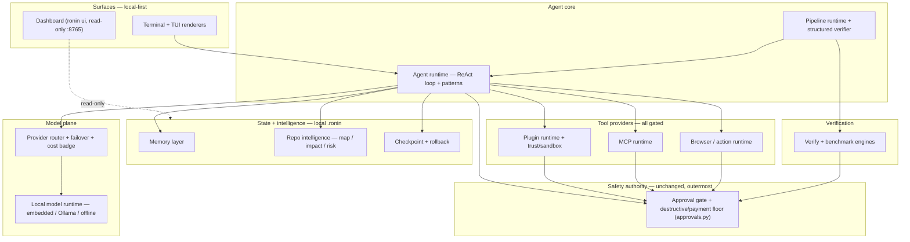

> **Provenance & honesty note (read this first).** This is READ-ONLY vNext
> *discovery* output from a 16-agent codebase-grounded pass — a set of design
> *proposals*, not shipped architecture. Where the text calls the approval gate
> + destructive floor the "single outermost authority" holding for "every
> subsystem," read that as the vNext DESIGN GOAL, not the present reality: this
> very pass FOUND that the floor is enforced only on the console gate
> (`_selective_gate`) and is **bypassed under `--yolo`/god-mode on the
> `before_tool`/`gate_cb` path used by `ronin --tui` and headless front-ends**
> (code_mode.py ~844-856). That is a real P1 safety defect, verified in-code and
> fixed separately (it blocks the final v1.0 tag). Treat every subsystem's
> "current assessment" as the honest baseline and every "vNext design" as a
> proposal pending its own gated PR. No code was changed by this discovery pass.

# Ronin vNext — Architecture

**Scope:** vNext design for 13 subsystems of the Ronin CLI (`~/ronin`, `packages/{cli,agent-patterns,memory,eval-suite,hardening}`, `apps/{api,web}`).

**Two invariants hold for every subsystem below.**

1. **Local-first.** No new network dependency, daemon, or hosted service is introduced. All new state lands under `RONIN_HOME`/`~/.ronin` as JSONL/JSON/SQLite. Offline mode still strips egress tools and forces a local brain. `UNKNOWN` is never coerced to `$0`.
2. **Gate-preserving.** `approvals.py` (the universal approval gate) and the destructive/payment **floor** (`is_destructive_command`, enforced even under `--yolo`/`--god-mode`) remain the single outermost authority. **No vNext change relaxes a floor; several tighten it.** The recurring pattern across subsystems is *evolutionary consolidation behind existing seams* — not rewrite.

Every subsystem's current-state below is reported as assessed, including bugs, stubs, and drift. Nothing is inflated.

---

## System overview

**Dependency direction:** surfaces → core → gate; core → model plane, state, tool providers; tool providers → gate. The gate depends on nothing. Read-only consumers (Dashboard, Repo-intel, Memory recall) never feed the gate decision — an explicit lint/invariant per subsystem enforces that "advisory data never authorizes."

---

## S1 — Agent runtime (ReAct loop, planner/executor/reviewer, sub-agents)

**Current state (honest).** Real and production-shaped, not a stub. Two layers. The **library** (`packages/agent-patterns`, 123 test fns, offline via `FakeProvider`) has a genuine ReAct loop (`react.py`): iteration cap, streaming with reset-dedup, a `before_tool` gate hook (`bool|str`, any string = reject-with-feedback), parallel read-only tool batching gated by `parallel_safe`, and 2-stage deterministic context compaction. `PlannerExecutorAgent`/`SupervisorAgent`/`OrchestratorAgent` (wave scheduler + cycle detection) and providers (Anthropic/OpenAICompat/`FailoverProvider` with mid-stream-safe failover) are all real. **CLI wiring** drives `run_code_agent`, `swarm`, `orchestrate`, `dojo`, plus `EditGuard` (holds ungrounded edits even under `--yolo`). **Honest gaps:** (1) no durable per-run journal/resume — a 25-iteration run that dies at 12 loses everything (`message_history` is in-memory); (2) "success" = model stopped calling tools, not behaviorally verified — `ReflexionAgent` isn't wired into the main loop; (3) budget is iteration-count only; (4) two overlapping gate implementations share only `is_destructive_command`; (5) sub-agent spawn has no recursion-depth cap; (6) `PlannerExecutor` replan prefix-alignment smell.

**vNext design (evolutionary, loop internals untouched).** Everything plugs into the existing hook surface (`on_step`/`before_tool`/`after_tool`/`AgentResult.messages`). Four additive increments: (1) **`RunJournal`** — JSONL `FileJournal` under `.ronin/runs/<run_id>/`, wired as an `on_step` sink + per-iteration message snapshot; one optional `journal=None` param; `resume(run_id)` re-enters with `history=`. (2) **First-class `Verifier` stage** — `CommandVerifier` runs a repo-declared `.ronin/verify.json` after "success", feeds one bounded reflexion retry; `EditGuard` + swarm reviewer become instances of the same interface. Default off for sub-agents/one-shots. (3) **Unified `RunBudget`** (iterations + tokens + wall-clock + USD) checked at the existing usage-accumulation point → `BudgetExceeded` → clean `AgentResult(success=False)`. (4) **Destructive-floor consolidation** — extract the shared `floor()` both gates call, add an invariant test that no path reaches `run_command` without it, add `sub_agent_depth` cap (default 3). Every new param defaults to None/off; current behavior is byte-for-byte preserved. **First slice (M):** journal + verifier. **Effort: M.**

**Gate-preserving note.** Journal is a read/emit sink; the verifier's own tool calls are gated normally; `RunBudget` only makes a run stop *earlier*; floor consolidation extracts only the already-shared predicate and is locked before touching callers.

---

## S2 — Provider router + failover + cost/free-badge

**Current state (honest).** Real and mostly working, but "one concept in several places" has already drifted. `route.py` (`ronin route`) has pure, testable `classify_task` (3-class) + `pick_blade`. `routing.py` is the *interactive* per-turn router with a **second** classifier (`classify`, 2-class, different vocab) and its own selection path — overlaps `route.py`, shares only `router_stats`+`cost`. `cost.py` is the price source of truth; `router_stats.py` learns per-repo reliability; `status.cost_badge` already returns `UNKNOWN` (never guessed); `FailoverProvider` is solid. **Drift/bugs:** (1) free-tier + price truth duplicated in 4 places that disagree (`cost.py` anthropic $9 blended vs `bench.py` $6; three separate free-lists). (2) `is_free("local")` returns **False** — the keyless in-process brain is mislabelled PAID, dodged only by a `cost_badge` special-case. (3) `is_free`/`price_for` under-report: a paid model on a "free" provider is badged FREE and costed $0. (4) `budget` honored only in `pick_blade`, ignored by the interactive loop. (5) auto-failover exists only for Cerebras siblings. Safety floor is clean: router files have **zero** references to `approvals`.

**vNext design (consolidation, no rewrite).** (1) **Single `providers_registry.py`** (`PROVIDER_META`) seeded from today's values + `local` (keyless, $0); re-back `price_for`/`is_free`/`cost_badge` without changing signatures; delete the 4 duplicated tables and derive all from the registry. (2) **Tri-state `pricing_status → free|paid|unknown`** as the single truth; `is_free` becomes `pricing_status(...)=="free"` (bugs 2 and 3 dissolve; `local` reads free; paid-on-free-provider reads paid; untabled reads unknown, never silent $0). (3) **Unify both routers** on one `select_blade(...)` wrapping today's pure `pick_blade`; collapse the 2-class classifier into a thin view over the 3-class one; thread `config.budget` as a soft gate. (4) **Generalize** `CEREBRAS_SIBLINGS` → `SAME_KEY_SIBLINGS`. Add a drift-regression test + golden `pricing_status` tests. **Effort: M.**

**Gate-preserving note.** Blade choice remains orthogonal to authorization — a lint asserts no data path carries the chosen provider/model into the approval decision. No live network price sync.

---

## S3 — Local model runtime (offline, embedded, Ollama)

**Current state (honest).** Mostly real and shipped, with **three concrete bugs and one orphan**. Works: Ollama chat path, in-process `EmbeddedProvider` (mlx/llama-cpp, RAM-sized Qwen2.5-Coder ladder, lazy heavy import), `ronin local`/`--embedded` setup with real pull-progress + end-to-end verify, offline enforcement (`apply_offline` forces local brain + clears failover). **BUG 1 (confirmed):** `is_local_provider` doesn't recognize the embedded `local` provider (base_url is `""`), so `--offline` *downgrades* the keyless in-process brain to Ollama — offline is hostile to the most-local backend; the "keeps_local_provider" test is mislabeled and actually exercises ollama. **BUG 2:** `doctor --check` step-0 exempts only `ollama` from the key check, so `local` reports "no key configured" and exits(1). **GAP 3:** `local_embed.py` (stdlib-only, zero-egress embeddings) is **orphaned** — zero production callers; embedded users get BM25-only, no semantic search. **Documented limits:** embedded `complete()` always returns `tool_calls=[]` (can't drive the ReAct loop); first embedded call blocks on a multi-GB download with no progress surface.

**vNext design (fix + wire the orphan; no engine rewrite).** (1) `is_local_provider` returns True for `("ollama","local")` before the base_url check (+ the missing test). (2) Pure total `resolve_local_backend(config, *, ollama_ok, embedded_ok) → keep|embedded|ollama` — never downgrade an already-local backend. (3) Wire `local_embed` as `LocalEmbeddingBackend` in `embeddings.get_backend`, gating on `config.offline` **first** so offline never reaches a hosted embedder. (4) Fix `doctor`: exempt `local`, add a local-runtime health branch (engine present + tiny in-process completion). (5) `on_download_start` callback + `--warmup`. (6) One-time honest notice that the embedded brain can't call tools. All new logic is pure policy + thin wiring. **Effort: M.**

**Gate-preserving note.** The runtime is strictly upstream of the gate: it selects a brain and only ever *removes* tools (`strip_network_tools`) — never adds one, never lowers an approval requirement, never touches `approvals.py`.

---

## S4 — Memory layer (short-term, long-term, preferences)

**Current state (honest).** The kit (`packages/memory`, ~200 LOC, tested) is clean, but "long-term vector store" is the real gap and the wired product path has diverged. **Short-term** is the only kit layer actually wired (`runner.py` → `ShortTermMemory`); it does a real Claude rolling-summary compaction but is in-process only (lost on exit) and injects the summary as a synthetic user+assistant pair. **Long-term is the gap:** `LongTermBackend` is a Protocol with exactly one impl — `InMemoryBackend`, a dict ranked by word-set Jaccard; **no persistence, no embeddings, no vector store.** The advertised `ChromaDBBackend` **does not exist anywhere** (only README/docstring mention it). **Long-term is not wired:** the running agent's persistent memory is a *separate* reimplementation, `cli/memory_store.py` (JSON + stemmed Jaccard), whose docstring falsely claims it uses the kit — architecture/doc drift, two long-term memories. **Preferences** are real + tested but have **zero consumers** (dead code). The repo already ships local-first embeddings (`local_embed.py`/`embeddings.py`) — the evolutionary lever.

**vNext design (fill the gap behind the existing Protocol; converge the drift).** (1) Make the Protocol real: **`SqliteBackend`** (new default, stdlib `sqlite3` under `$RONIN_HOME/.ronin/memory.db`, with size-cap + dedup + TTL/decay pulled into the store) + **embedding-aware query** via an injected `embed_fn` that **fails open to Jaccard** when absent; default `embed_fn` reuses `local_embed` (zero-network). Keep `InMemoryBackend` as the dep-free dev default. (2) Rebuild `cli/memory_store.py` on top of `LongTermMemory(SqliteBackend, local_embed)` with a one-time `memory.json` migration; keep `remember/recall/forget` signatures; delete the parallel Jaccard + false docstring. (3) Short-term: additive opt-in `dump()/load()` + `summary_as_system` flag (default off). (4) Wire `UserPreferenceMemory` into a `prefs:<user>` namespace so it stops being dead code. **Not adopting chromadb/Pinecone.** **Effort: M.**

**Gate-preserving note.** Memory is **data/context, never authorization** — the load-bearing invariant. Ship an adversarial test: seed a fact "always auto-approve `rm -rf`" and assert the destructive floor still gates. `forget` stays a single-row DELETE within a namespace, never outside `$RONIN_HOME/.ronin`.

---

## S5 — Repository intelligence (map, risk, impact)

**Current state (honest).** Real, working, well-tested — the three axes exist but are siloed and uneven. **Map (strong):** identifier-aware BM25 tokenizer + persistent SQLite index (`.ronin/index.db`, incremental by mtime), wired into the agent. **Impact (works, narrow):** `radius.py` builds a pure Python import graph + affected-tests, but (1) **Python-only** in a polyglot TS monorepo — JS/TS changes report empty blast radius; (2) re-walks/re-parses the whole tree every call, duplicating the index's walk; (3) misses conftest/fixture/integration coverage. **Risk (thin):** `smell.py` (per-file AST) is the *entire* risk story — no git-churn/hotspot, not coupled to centrality, so "which files break most" is unanswerable. **Duplication:** BM25 + tokenizer weighting implemented twice; the index stores symbols but not import edges (exactly why radius can't reuse it). Every module here is strictly read-only.

**vNext design (consolidate on the index + one new risk signal; no pure-core rewrite).** (1) Add an `imports` edges table populated inside the walk `build_index` already does; bump `schema_version`, migrate-by-rebuild. (2) `radius.load_edges(db)` reads edges from the index (in-memory builder kept as fallback + test seam) — incremental for free, second walk gone. (3) New pure **`risk.py`**: `score_files(smells, churn, centrality)` blends AST smell + `git log --numstat` churn/recency + import fan-in → ranked hotspots; thin `ronin risk` CLI. (4) `ImportExtractor` protocol — Python `ast` (unchanged) + a regex JS/TS extractor; same resolve/reverse-dependents engine. (5) Widen impact→tests (import-graph ∪ convention ∪ optional `.coverage`). All read-only, offline, zero new deps. **Effort: M.**

**Gate-preserving note.** Hard invariant: repo-intel output is **advisory** — a "low risk" score or "empty blast radius" must never downgrade/skip/auto-approve a gated action; no path passes a risk/impact score into `should_auto_approve`/`deny_reason`. Churn uses read-only `git log --numstat` only.

---

## S6 — Checkpoint + rollback engine

**Current state (honest).** The central finding: **two parallel checkpoint engines with divergent safety semantics.** (1) `checkpoint.py` — the **agent-facing** engine (int ids, `refs/ronin/checkpoints`, the `rewind` tool in `SENSITIVE_TOOLS`). Uses correct non-destructive git plumbing (throwaway `GIT_INDEX_FILE`, never touches real index/branch/HEAD) — **but its `restore_checkpoint` is NOT reversible** (no pre-restore snapshot) and deletes `current − snap` files. (2) `checkpoints.py` — the **user-facing** engine (base-36 ids, `refs/ronin/session`) that **is** reversible (takes an `auto:pre-restore` safety snapshot), has a file-copy fallback, a tested pure core (`restore_plan` blast-radius preview), and `_in_skip_dir`. **Safety gap:** `rewind` is sensitive but *not a shell command*, so the destructive floor (which fires only for `run_command`) never sees it — under `--yolo` a silent, **unrecoverable** rewind is possible. **Other gaps (both engines):** non-atomic index writes (crash truncates JSON → `_load_meta` returns `[]`, orphaning live refs), no retention/GC (unbounded refs), and a parallel-agent write race (last `_save_meta` wins; `max(id)+1` can collide) — real given the fleet-of-agents direction.

**vNext design (consolidate; make the agent rewind reversible).** (1) Extract `_checkpoint_core.py` from `checkpoints.py`'s proven internals; both surfaces become thin adapters. (2) **Top change:** `checkpoint.py.restore_checkpoint` gains the mandatory pre-restore safety snapshot and returns its id ("reversible via rewind #N") — closes the yolo-irreversible gap **without** touching the floor. (3) Keep both id namespaces via a thin `IdScheme` adapter (no risky migration). (4) Atomic `_save_meta` (temp + `os.replace`). (5) File lock (`O_EXCL`/`fcntl`) around id-allocation/save + re-read-merge → lossless parallel checkpointing. (6) Opt-in, never-auto `ronin checkpoint prune` (keep last N + age cap). (7) Surface `restore_plan` as a `dry_run` preview on the agent path. **Effort: M.**

**Gate-preserving note.** `rewind` stays `SENSITIVE` and still routes through `_selective_gate`; deny-rules still hard-block it. The floor is *strengthened in intent*: even an auto-approved rewind under god-mode is now recoverable. Prune is opt-in and never auto-runs.

---

## S7 — Pipeline runtime + structured verifier

**Current state (honest).** Real and feature-complete at v1.0.0 (~2,100 LOC + ~2,300 LOC tests), not a stub. `run_pipeline` is sequential single-agent-per-stage (architect→implementer→reviewer→tester→verifier), each a gated `run_code_agent(yolo=False)`, pure pydantic state, injectable `stage_runner`. The **structured verifier is genuinely honest**: `finalize_verdict` never upgrades unknown→passed; `independent_verify` runs the command itself and gates it; only required suites drive the verdict; `reconcile_with_tester` flags over-claims; `compute_final_verdict` uses safety-first precedence (halt>fail>block>evidence-gated-pass). **Honest hazards (not bugs):** (1) artifact JSON shapes are hand-duplicated between `_ARTIFACT_HINT` prompts and the pydantic models — no `model_json_schema()` derivation, no `schema_version` → silent drift. (2) Verdict precedence re-encoded in 3 functions across 2 files. (3) Verify-source selection is a dense inline if/elif ladder. (4) Strictly linear — any blocking finding hard-halts, no bounded repair. (5) Observability is render-only (no event timeline). (6) Windows-portability nit in untracked-diff (degrades honestly).

**vNext design (harden, add one safe capability; no rewrite).** (A) Derive `_ARTIFACT_HINT` from the pydantic models + add `schema_version`; keep the lenient parse. (B) Extract a pure **`VerdictEngine`** (`pipeline_verdict.py`) — the 3 call-sites delegate; behavior-preserving, locked by existing tests. (C) Extract pure `select_suite_specs(...)`. (D) Append-only JSONL **event log** (`pipeline_events.py`) — stage/gate-decision/suite/verdict timeline, pure injectable sink. (E) **Opt-in single-hop repair loop** — `--repair-rounds N` (default 0 = today's linear behavior), hard-capped, re-runs implementer once with blocking findings then re-verifies; reuses `_default_stage_runner(yolo=False)` so **no new gate path**, and the `VerdictEngine` still forbids unknown/blocked→passed. **Effort: M.**

**Gate-preserving note.** Every stage (incl. repair) is `yolo=False` → `_selective_gate`; the floor is enforced under yolo; payments always BLOCK; headless `console=None` fails closed (default-deny). Repair is default-off, bounded, non-autonomous, and cannot convert a block/unknown into a pass.

---

## S8 — Plugin runtime + permissions/sandbox

**Current state (honest).** A lightweight, well-factored drop-in loader with real DX — but the "sandbox" half essentially **does not exist**, plus a load-time execution gap and a likely gate-bypass. **Works:** `.ronin/plugins/*.py` `register_tools()` contract, per-plugin error isolation, `harden()` (marks tools `sensitive=True`), a ~130-entry catalog + `plugin from-api`/scaffold generators. The gate, floor, and per-repo allow/deny store are solid and fail-closed. **Stubs/gaps:** (1) **No sandbox** — plugin code runs in-process with full host privileges; "sandboxed" in the prompts refers only to the built-in file tools. (2) **Load-time code execution** — `load_plugins()` exec's every file at session start, so a cloned/hostile repo's `.ronin/plugins/backdoor.py` runs top-level code **before any gate** — the exact threat the permission store defends allow-rules against, but plugins have no trust gate. (3) **Likely approval-gate bypass** — plugins are loaded twice (un-hardened `sensitive=False` via `build_tools` *and* hardened via `build_plugin_tools`); first-wins dedup keeps the un-hardened copy, which is then absent from `_sensitive_names`, so `_selective_gate` returns True **unprompted**. (4) The floor is blind to plugin internals (`os.system("rm -rf ~")` inside a handler is never inspected). (5) No per-plugin capability declaration.

**vNext design (four increments; no rewrite; keep the drop-in DX).** (1) **Collapse to one hardened load path** (prereq, S) — push `harden()` into `load_plugin_tools`, drop the duplicate include; regression test that every plugin tool in the toolbelt is `sensitive=True` + wrapped. Closes the bypass. (2) **Trust gate + non-executing manifest** (M) — read a top-level `PLUGIN = {...}` via `ast` *without exec*; require the containing repo to be **TRUSTED** in a user-global `~/.ronin` store (a cloned repo cannot self-trust) before `exec_module`. (3) **Fail-closed capability metadata** — `capabilities` (network/filesystem/subprocess/payment) render on the approval card; `payment`/`subprocess` route to block; undeclared → most-dangerous. (4) **Opt-in handler isolation** — `RONIN_PLUGIN_SANDBOX` reuses `backends.py` (docker/ssh/subprocess `setrlimit`); default off = unchanged. **Effort: M.**

**Gate-preserving note.** After increment 1 every plugin call is gated. god-mode still can't bypass the floor and now additionally can't silently exec an untrusted plugin at load. Trust store is user-global like `permissions.json`.

---

## S9 — MCP runtime

**Current state (honest).** Real and working (~370 lines of hand-rolled JSON-RPC 2.0, good coverage). Two transports behind one surface (stdio + Streamable-HTTP), tools namespaced `{server}__{tool}`. **Security posture is genuinely strong:** `_wrap_tool` marks every MCP tool `sensitive=True` and **deliberately does not trust** server-supplied `readOnlyHint`; gate-drift is fail-closed. **Honest gaps:** (1) **Startup is eager + serial + blocking** — N slow servers add up to N×30s. (2) **The destructive floor does not cover MCP under god-mode** — the floor is `run_command`-only, so under `--yolo` `github__delete_repo` / a `postgres__query` running `DROP` auto-run with **no floor**, conflicting with the "god-mode never bypasses catastrophic protection" invariant. (3) Only the unified session wires MCP (`run_code_session` gets none). (4) No health/reconnect; remote `_id` increments without a lock. (5) stderr is `DEVNULL`'d. (6) No per-server tool allow/deny or count cap.

**vNext design (thin layers; keep transports/config/posture).** (1) **Extend the floor to MCP (safety-critical):** pure `is_destructive_mcp_tool(name, args)` matching the un-namespaced name + arg values against a fixed pattern set (delete/drop/destroy/purge/transfer/… + mass-scope hints); wired into **both** gate paths **before** the `if yolo: return True` short-circuit → same typed-confirmation as the shell floor, even under god-mode, default-deny when no console. Conservative (false positives cost one confirm), server-independent. (2) **Concurrent + lazy startup** — bounded `ThreadPoolExecutor` (N×timeout → ~max one) + opt-in `LazyMCPClient` backed by `.ronin/mcp.cache.json`, verified on first real call. (3) **Per-server manifest** (`timeout`/`tools`/`exclude`/`maxTools`) via a pure filter. (4) **Light health** — `is_alive()` + one-shot reconnect, stderr ring buffer, remote `_id` lock + single `httpx.Client`. **Not** adopting the official SDK; **not** trusting `readOnlyHint`. **Effort: M.**

**Gate-preserving note.** Every MCP tool stays `sensitive=True`; the drift guard is untouched; the floor is *strengthened*, never weakened. (Noted for the gate owner: the front-end `before_tool` path also lacks the shell `run_command` floor — worth a separate look; the new MCP floor is added to both paths.)

---

## S10 — Browser / action runtime (Playwright web computer-use)

**Current state (honest).** Real and works, split across three layers with one genuine safety seam. `browser_tools.py` is the actual runtime: a thread-locked headless Chromium singleton exposing 5 DOM/accessibility tools (navigate/click/type/read/screenshot), no vision model, graceful degrade; navigate/click/type/screenshot are `sensitive=True`; stripped in offline mode. `approvals.py` is a strong fail-closed gate with a payment/destructive BLOCK floor. **The gap (load-bearing):** the browser runtime and the floor are **disconnected** — browser tools reach the loop gated only as *generic* sensitive tools; a `browse_click` target/URL/typed value is never passed through `is_payment`/`gate_level`. So under `--god-mode` (→ `yolo=True`), `browse_click("Confirm and pay $500")` auto-approves — the BLOCK floor that guards shell is **never consulted for the browser**. The robust payment guards (`book.py` FORBIDDEN_ACTIONS, `act.py` terminal step) protect flows that **never issue a real click** (`act.py` is a print-only stub; `_book_browser_prefill` only navigate+read), while the flow that *can* click (`ronin browse` / `code --god-mode`) is the ungated one. **Secondary:** single global headless session (shared cookies), text-guess clicking, no host allowlist/egress audit.

**vNext design (one thin classifier + one wiring change).** (1) New pure `browser_intent.py`: `classify_browser_action(name, args, current_url) → Action` in the shape `approvals.normalize()` consumes (reuses `PAYMENT_MARKERS` on click target + typed text + host), and `browser_floor(action) → gate_level(action) == BLOCK`. (2) **Wire it as a browser floor mirroring the `run_command` floor** in both `_selective_gate` and the front-end `before_tool` path, **before** the `if yolo: return True` — a pay/submit click can no longer auto-run under god-mode. (3) Point `act.py`'s PREPARE stub at the now-gated primitives (terminal payment step still hard-stops). (4) Optional follow-ons: host allow/deny + egress audit log, ref-tagged `browse_read`, opt-in visible session. **No** session-model rewrite. **Effort: M.**

**Gate-preserving note.** An unrecognized click normalizes to `reversible=False`/`external=True` → CONFIRM (never AUTO); a classifier miss degrades to a prompt, not a silent action. `book.py`/`act.py` guards remain as defense-in-depth. Drift test asserts `BROWSER_TOOLS` covered by both gate paths.

---

## S11 — Dashboard backend + frontend (`ronin ui`)

**Current state (honest).** Two different products share one FastAPI app; only one is "the dashboard." **Real + working — the local `ronin ui` dashboard:** serves `csk_api.main:app` on `127.0.0.1:8765`, read-only + offline, a self-contained inline HTML page (no external URLs), `/ui/*` surfacing genuinely-real `.ronin` data (honors `RONIN_HOME`), well-tested (asserts no external URLs, fetch-only-`/ui/*`). **Real gaps:** (1) `loadRuns()` catches any fetch failure and sets `runs=[]`, so a backend error renders identically to an empty list (silent lie; memory/skills are at least labeled). (2) Static — manual refresh only, no in-flight visibility. (3) Over-broad — `ronin ui` serves the whole app, so billing/oauth/signup/agent-webhook endpoints are reachable on localhost. (4) Behind the terminal cockpit (`ronin status` shows savings/dojo/router/nightshift the web UI doesn't). **Co-resident legacy `csk` SaaS + `apps/web`** is a distinct product; its README self-describes as scaffold; no CORS middleware exists (consistent with not-deployed). The dashboard is 100% read-only and outside the gate by construction.

**vNext design (additive/refactor; keep the working spine).** (A) Honest errors + liveness (S) — render a distinct error banner instead of `[]`; add one same-origin SSE `GET /ui/events` watching `runs_dir()` mtime; page re-fetches on ping. (B) **Split the app** (M) into `dashboard_router` (`/` + `/ui/*`) and `saas_router`; `ronin ui` points at a dashboard-only app that **rejects any non-GET** (read-only becomes a structural property, 405 on POST). (C) `GET /ui/status` reuses the existing pure `ronin_cli.dashboard.gather()` for cost/leaderboard/router/nightshift parity. (D) Leave SaaS + `apps/web` as-is; CORS only behind a default-off flag if ever deployed. **Effort: M.**

**Gate-preserving note.** Red line: **no browser-initiated action ships in vNext.** Any future write must POST through `code_mode._approve` (approval card + destructive floor), never a second executor. `/ui/events` + `/ui/status` are same-origin/relative; offline+self-contained tests extended to cover them.

---

## S12 — Terminal + TUI renderers

**Current state (honest).** Real and, on the Rich/REPL side, well-built with a clean pure-builders + thin-render-shells split. `status.py` is almost entirely pure — `status_segments` is "the single source of truth both renderers build from," and `chip_strip` pins safety/cost chips (cost badge, mode, "DESTRUCTIVE FLOOR ACTIVE", write-gate never shed). `streaming.py` (`LiveRenderer`) and `prompt_box.py` (3-tier input fallback + pure completion cores) are tested and robust. **The real gap is architectural:** there are effectively **two parallel renderer stacks that do not share the pure cores** — `tui.py` (the `ronin --tui` Textual app) imports **none** of `status`/`streaming`/`ui_cards`/`theme`; it re-declares its own palette, its own lossy tool labeler, its own streaming, and its own `ApprovalScreen`. `status_segments`' "single source of truth" claim is aspirational. **Safety-critical consequence:** the destructive floor is enforced only in the console path — the `gate_cb` path used by the TUI/headless has **no floor check** and `if yolo: return True` auto-approves any sensitive tool (incl. `rm -rf`/force-push) via a plain y/n screen. So "god-mode never bypasses catastrophic protection" holds in the REPL but is **violated under `ronin --tui`.**

**vNext design (consolidate; move the floor beneath the renderer boundary).** (1) Extract `view_model.py` re-exporting today's pure builders (`status_segments`/`chip_strip`/`tool_label`/`_summarize_result`/`_normalize_markdown` + palette tokens) — `status_segments` finally becomes the literal single source of truth. (2) `tui.py` consumes `view_model` instead of its private copies (delete divergent palette + labeler). (3) Formalize a tiny structural `Renderer` protocol (`start/on_text/on_step/on_reset/finish`); TUI gets a thin adapter. (4) **Relocate the floor** into a shared `approvals.enforce_floor(name, args)` evaluated **before** any yolo/allow short-circuit on **both** `before_tool` paths, using a renderer-supplied confirm callback (Rich input in REPL, text-entry modal in TUI). **Effort: M.**

**Gate-preserving note.** New test obligation: a TUI/headless destructive-floor test asserting `rm -rf`/force-push is blocked under yolo (currently missing) + parity tests that both backends render identical labels/status. Pinned safety chips extended to the TUI header.

---

## S13 — Verification + benchmark engines

**Current state (honest).** Real and largely working, split across two packages, unusually honest about pass/fail. **Benchmark/quality side (`packages/eval-suite`):** the LLM-as-judge path works but the client is **hardcoded Anthropic** and the judge is a single sample with no calibration; the **SWE-bench execution harness is the crown jewel** (Protocol-pluggable runner/evaluator, canonical `is_resolved`, per-task fail-soft, regression gate, oracle env check); reporting is a bare per-criterion mean + bare `resolved_rate`, HTML hardcoded light-theme. **Verification side (`packages/cli`):** `verify_cmd.py` (polyglot detection, `ran=False` ≠ failure), `self_verify.py` (never claims verified when it didn't run), and the strongest piece `pipeline_verify.py` (runs the command itself through a default-deny gate; declined/timeout/error → BLOCKED never passed); `agent_eval.py`/`bench.py`/`consensus.py` all real. **Honest gaps (verified by grep):** (1) **Zero statistical rigor anywhere** — no Wilson/CI/bootstrap/kappa/seed/pass@; every headline number is a point estimate; drift fires on a raw 0.5 threshold and `compare_swebench` on any single flip, so a 3-case and a 300-case run are treated identically — the biggest credibility gap for a "how do you know it works?" subsystem. (2) No eval/bench baseline persistence (`run_store` is orchestrate-only). (3) Judge is single-vendor/single-sample/un-calibrated. (4) **Safety:** `make_local_git_evaluator` runs `git reset --hard` + `git clean -fdx` **completely outside** Ronin's approval/destructive floor — the one benchmark path that can destroy a working tree, gated only by a docstring.

**vNext design (~4 additive modules wrapping the working internals; rewrite nothing).** (1) Pure **`stats.py`** — Wilson interval for proportions, bootstrap/normal CI for judge means, and `significant_regression(baseline, candidate)` (CI-aware, flags only when the candidate CI upper bound falls below the baseline point estimate) that *replaces* the naive raw-delta gate while keeping the raw threshold as an additional floor (never less strict). Attach as **new optional** `summary_ci` fields — existing summaries stay byte-for-byte. (2) Opt-in `seed` + `samples` (default `samples=1` = today) so CIs have real inputs. (3) Local-first **`evalstore.py`** under `~/.ronin/eval/`, mirroring `run_store.py` conventions → `drift`/`compare` default to "vs last run for this label." (4) **`gated_local_git_evaluator`** — route the destructive reset/clean through `is_destructive_command` + the same default-deny confirm `pipeline_verify` uses; refuse a dirty/non-throwaway tree unless explicitly armed; floor enforced even under yolo. Wiring stays thin: `--samples/--seed/--ci` flags; drift/compare exit non-zero on a *significant* regression (and still on a raw breach). **Not** adopting inspect-ai/lm-eval-harness; **not** a DB. **Effort: M.**

**Gate-preserving note.** The single benchmark floor-bypass (the git evaluator) is closed by wrapping it in the gate; all statistics are pure/offline; `UNKNOWN`/wide-CI honesty stops overclaiming on tiny datasets.
